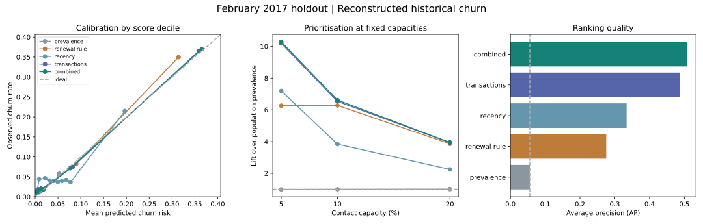

# Milestone 3 — temporal churn evaluation

**Complete, 22 September 2026.** The frozen combined logistic regression identifies a useful concentration of reconstructed historical churn: at 10% contact capacity it captures **66.13% of churn**, with **36.97% precision and 6.61× lift**. Source-version sensitivity materially changes the expected results, so this supports further decision analysis rather than deployment or savings claims.

The evaluation covers **680,401 distinct February 2017 customers**, including **38,037 reconstructed churn outcomes (5.59%)**. Code, aggregate evidence and charts are public; customer records, scores and fitted model bundles remain private.

## How the decision was made

Training used 2,389,257 customer/date rows from May–August 2016, representing 775,948 people. October selected model settings and December fitted a sigmoid probability mapping. Base models were not refitted on later months. The final February outcomes were evaluated after the [plan and model freeze were published](https://github.com/Jeks042/subscription-churn-retention/commit/d74713a28cb751c8afc411877426c56edd4762f5).

The rule selected the simplest candidate within 0.5% of the best October log loss. Combined logistic regression had log loss 0.128601 versus 0.129561 for transactions alone: a modest 0.74% relative improvement, sufficient under that rule. Both selected C=1. The models use signed log1p transformations and training-only standardisation; the SQL input's missing-value medians were also training-only. IDs, future events and member attributes are excluded from predictors.

A nonlinear challenger was deferred. The immediate question was whether transparent risk models and listening features add value over simple rules, with source reliability assessed alongside predictive scores.

## Final-test comparison

All rows below use the December-calibrated probabilities. AP is average precision, the declared precision–recall summary. Lower log loss/Brier and higher AP/AUC are preferable. The constant benchmark uses December prevalence and a deterministic arbitrary ordering for contact selection.

| Model | Log loss | Brier | AP | ROC-AUC | Precision at 10% | Recall at 10% |
|---|---:|---:|---:|---:|---:|---:|
| Prevalence benchmark | 0.215634 | 0.052788 | 0.0559 | 0.5000 | 5.58% | 9.97% |
| Renewal rule | 0.153567 | 0.041875 | 0.2755 | 0.8330 | 35.09% | 62.77% |
| Transaction recency | 0.183815 | 0.042809 | 0.3340 | 0.6749 | 21.47% | 38.40% |
| Transaction logistic regression | 0.143355 | 0.036479 | 0.4877 | 0.8513 | 36.52% | 65.33% |
| **Combined logistic regression — frozen choice** | **0.141276** | **0.035911** | **0.5080** | **0.8661** | **36.97%** | **66.13%** |
| Combined without duration totals — sensitivity | 0.141335 | 0.035925 | 0.5079 | 0.8660 | 36.95% | 66.09% |

The combined model captures 1,278 more reconstructed churners than the renewal rule and 306 more than the transaction-only model at the same 68,040 contacts. These are improved historical identifications, not customers saved by an intervention. Listening adds a modest increment; the bulk of predictive value is already available in transaction history.

Removing duration totals and their missing flags leaves 32 predictors and almost unchanged performance. This suggests limited dependence on duration magnitude in this fitted linear model. It does not establish that the 86,400-second daily cap is correct, or that other duration treatments are equivalent. The ablation was prespecified as sensitivity and did not replace the frozen model after the test.

## Capacity and error trade-offs

Capacity is an illustrative fraction of eligible customers, not an approved operating budget. Ties use SHA-256 customer-key ordering independent of outcomes.

| Capacity | Contacts | Churn captured | Contacted observed renewers | Churn outside list | Precision | Recall | Lift |
|---|---:|---:|---:|---:|---:|---:|---:|
| 5% | 34,020 | 19,557 | 14,463 | 18,480 | 57.49% | 51.42% | 10.28× |
| 10% | 68,040 | 25,155 | 42,885 | 12,882 | 36.97% | 66.13% | 6.61× |
| 20% | 136,080 | 30,031 | 106,049 | 8,006 | 22.07% | 78.95% | 3.95× |

Doubling capacity from 10% to 20% adds 68,040 contacts and identifies 4,876 additional historical churners. The commercial value depends on incremental offer response, contribution value and the cost of contacting/offering incentives to all selected customers. Observed renewers are not necessarily wasted contacts, and observed churners are not necessarily preventable losses.

The 200-replicate customer bootstrap gives a conditional 95% interval of **65.78–66.59% recall**, **36.59–37.45% precision** and **6.58–6.66× lift** at 10%. The paired precision gain over the renewal rule is **1.64–2.13 percentage points**. The same sampled customer weights are used for both models. February has one row per customer; training customers can recur across months.

These intervals condition on the fitted models and this one observed month. They omit training uncertainty, future time variation, source-truth uncertainty and treatment effects. The source sensitivity below is much larger than the sampling intervals.

## Calibration and stability

December calibration improves the combined model's final-test log loss from 0.141865 to 0.141276 and Brier score from 0.036374 to 0.035911. Mean predicted risk rises from 4.64% to **5.16%**, still below **5.59%** observed churn. Calibration helps but does not eliminate future-period underprediction. Fixed-width calibration bins and counts are available in the [full evaluation](model_evaluation.json); the figure uses score deciles, whose boundaries can divide tied scores.

Of the final-test customers, **525,297 (77.20%)** appeared in training and **155,104** did not. IDs are not predictors. This evaluates an existing-subscriber setting with a sizeable unseen group, not an entirely new-customer deployment claim.

| Diagnostic group | Customers | Observed churn | Mean predicted risk | ROC-AUC | Group contacted by the global 10% policy |
|---|---:|---:|---:|---:|---:|
| No listening records in 90 days | 133,486 | 2.59% | 2.68% | 0.6058 | 3.82% |
| Has listening records | 546,915 | 6.32% | 5.77% | 0.8831 | 11.51% |
| Member record absent | 85,887 | 2.50% | 2.65% | 0.6161 | 3.36% |
| Member record present | 594,514 | 6.04% | 5.53% | 0.8767 | 10.96% |
| Seen in training | 525,297 | 3.35% | 2.97% | 0.8002 | 4.98% |
| Unseen in training | 155,104 | 13.18% | 12.58% | 0.8938 | 26.99% |

The no-record and missing-member groups have weaker discrimination. They remain included; absent records do not establish inactivity. Member presence is a diagnostic snapshot join only. These groups overlap and must not be added together. Global contact allocation differs from the separate within-segment capacity scenarios in the JSON.

The largest absolute mean shift among nonconstant input features is about 0.112 training standard deviations (90-day auto-renew flag count); seven-day recorded listening falls by about 0.103. These averages do not rule out distribution or relationship drift. Capped-duration customers are also reported separately: 3,121 customers, 6.02% observed churn and 4.89% mean predicted risk.

## Source sensitivity changes the interpretation

The original-history-plus-March baseline remains frozen. Full-union backdated transactions produce a different eligible population and outcome set. We keep baseline features, fitted models and scores unchanged, then compare the two labels on common eligible customers. This isolates target/population sensitivity; it is not a full alternative-source retraining or proof that either source version is operational truth.

| Common February population: 679,309 customers | Baseline labels | Full-union labels |
|---|---:|---:|
| Churn outcomes | 36,992 | 26,420 |
| Observed churn rate | 5.45% | 3.89% |
| Mean predicted risk — same scores | 5.09% | 5.09% |
| AP | 0.4949 | 0.2632 |
| ROC-AUC | 0.8632 | 0.8218 |
| Precision at 10% | 35.85% | 23.39% |
| Recall at 10% | 65.83% | 60.14% |
| Lift at 10% | 6.58× | 6.01× |

There are **10,572 changed labels** within this common group; 1,092 baseline customers are absent from the alternative eligible cohort and one is alternative-only. These matched-population figures differ from the full-baseline headline because their denominator differs.

The same scores underpredict baseline churn but overpredict full-union churn. A 10% list still concentrates alternative-label risk, yet its observed precision falls by 12.46 percentage points. Commercial scenarios must therefore carry both source cases and avoid treating the baseline probabilities as settled truth.

The effect also appears before the final test: 8,154 common-customer labels change in October and 9,940 in December. Full-union precision at 10% is 24.11% and 23.50%, respectively, versus 35.14% and 36.18% under baseline labels. These use the fixed December mapping: October is a retrospective sensitivity diagnostic and December is a calibration-fit diagnostic, not independent future tests. No source convention or calibrator was selected from February performance.

## Verification and next decision

- All **21 synthetic tests pass**, including weighted/tied metrics checked against scikit-learn, capacity accounting, selection rules and training-only scaling.
- Independent verification of **96 final-test metric values across all six models** found **zero differences** against scikit-learn and separate exact top-k calculations on saved predictions.
- Full-union cohort counts reconcile to the earlier source audit. The published freeze predates the final-evaluation command; an exclusive marker prevents an accidental second evaluation in the same run directory.
- The 22 unexplained supplied-label differences and unknown ingestion availability remain unresolved. There is no exact-competition, verified historical availability, treatment-effect or production-readiness claim.

**Decision:** milestone 3 is complete for the declared retrospective scope. Proceed to milestone 4's explicit commercial scenarios and experimental design, carrying source uncertainty, uneven segment performance and calibration drift. Do not translate churn risk into expected saves without separate treatment-effect assumptions and evidence.

Evidence: [frozen plan](../docs/evaluation_plan.md) · [model freeze and selection grid](model_freeze.json) · [full evaluation and intervals](model_evaluation.json) · [independent metric check](model_metric_check.json) · [source reconstruction check](model_source_sensitivity_build.json) · [reproduction workflow](../docs/model_workflow.md).
