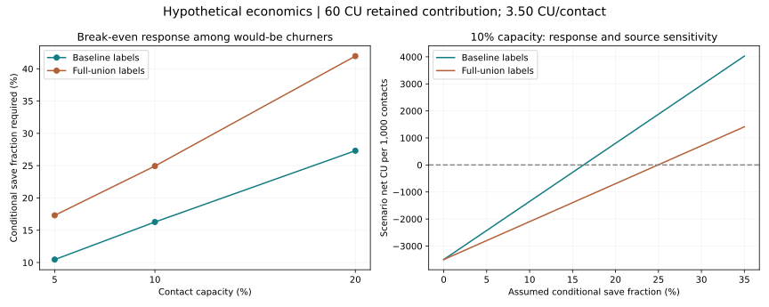

# Milestone 4 — commercial scenarios and experiment design

**Complete, 22 September 2026. Decision: further validation before a controlled pilot; no rollout recommendation.** Historical targeting is useful, but profitability depends on unverified response, value, costs and source labels. No campaign, incremental retention, realised savings or ROI has been measured.

At the reference **60 CU retained contribution and 3.50 CU per contact**, the matched 10% risk list needs to save **16.27% of would-be churners under baseline labels**, or **24.94% under full-union labels**. Assuming a 20% save fraction yields a **54,445 CU surplus** in the first case and a **47,087 CU loss** in the second. This changes the commercial conclusion without changing the scores or contact list.

## What is observed and what is assumed

The scores, pre-scoring recorded payments and reconstructed historical outcomes come from the frozen milestone 3 data. Everything about incremental offer response, contribution, costs and redemption is a scenario input. Historical outcomes are not experimentally established no-offer counterfactuals; using them as a control-risk proxy is itself an assumption.

All money is **generic currency units (CU)**. It is not KKBox pricing, GBP, TWD, a currency conversion or a financial forecast.

| Reference input | Declared assumption |
|---|---|
| Retained-service horizon | 90 days, represented as three 30-day months |
| Monthly fee | 40 CU |
| Contribution margin before intervention | 50% |
| Contribution per additional retained subscriber | 40 × 3 × 50% = 60 CU; assumes retention persists through the full horizon |
| Contact cost | 0.50 CU per assigned treatment contact |
| Offer cost | 10 CU per redemption |
| Redemption | 30% among both would-be churners and would-be renewers |
| Expected intervention cost | 0.50 + 10 × 30% = 3.50 CU per contact |
| Fixed setup cost | 0 CU in this reference; real setup costs must be added before a business decision |

For uniform value, a conditional save fraction s implies benefit per contact = churn scenario q × s × 60 CU. An absolute retention improvement delta implies benefit = delta × 60 CU: do not multiply an absolute effect by churn probability a second time. The reference absolute break-even improvement is **3.50 / 60 = 5.833 percentage points**, independent of source under uniform value and common costs. The conditional save requirement differs because the source changes q.

## Capacity raises the required response

For a direct source comparison, both cases use the **same 679,309 eligible customers** and the same ranked lists. These differ from the full baseline headline of 680,401 customers; the full-population and frozen-probability planning results are also retained in the JSON.

| Capacity | Contacts | Baseline historical churn in list | Full-union historical churn in list | Break-even conditional saves: baseline | Break-even conditional saves: full union |
|---|---:|---:|---:|---:|---:|
| 5% | 33,965 | 18,943 | 11,449 | 10.46% | 17.31% |
| 10% | 67,930 | 24,350 | 15,889 | 16.27% | 24.94% |
| 20% | 135,861 | 29,016 | 18,887 | 27.31% | 41.96% |

Larger lists identify more historical churn but dilute the concentration of that outcome. Under the same assumed value and contact costs, they require a higher save fraction to break even. No capacity is chosen as an approved campaign budget.

For the full baseline 10% list, the reference conditional threshold is 15.78%; for the matched list using summed frozen probabilities it is 16.25%. The latter is a model-based planning case, not independent treatment evidence. Its similarity to baseline labels does not resolve the alternative-source threshold of 24.94%.

## Downside, zero-effect and upside scenarios

The table uses the matched risk-only 10% list, **67,930 contacts**, with uniform value. Net CU includes costs for all contacts and expected redemptions by customers who would renew anyway. Fractional assumed saves are expectations, not observed retained people.

| Scenario | Effect assumption | Retained contribution / customer | Expected cost / contact | Baseline net CU | Full-union net CU |
|---|---|---:|---:|---:|---:|
| Adverse | −1 percentage point absolute retention | 60 | 3.50 | −278,513 | −278,513 |
| Downside | Save 5% of would-be churners | 36 | 7.00 | −431,680 | −446,910 |
| Zero effect | No incremental retention | 60 | 3.50 | −237,755 | −237,755 |
| Reference response | Save 10% of would-be churners | 60 | 3.50 | −91,655 | −142,421 |
| Higher response, reference costs | Save 20% of would-be churners | 60 | 3.50 | +54,445 | −47,087 |
| Optimistic | Save 20% of would-be churners | 84 | 1.75 | +290,203 | +148,058 |

Under the zero-effect case, the programme loses its whole expected cost. At 10% conditional saves, the baseline assumes 2,435 additional retained customers, while full union assumes 1,588.9; neither covers reference cost. Under baseline labels, 130,740 CU of the reference offer cost goes to observed renewers; under full union that figure is 156,123 CU. These costs cannot be omitted merely because the targeting model identifies churn risk.

The optimistic case combines 70% contribution margin, 0.25 CU contact cost, 5 CU incentive cost and 30% redemption. It is an alternative assumption set, not an estimated likely result. The downside uses 30% margin, 1 CU contact cost, 10 CU incentive and 60% redemption. The treatment concept includes a reminder and optional offer; the grid does not estimate the dependence between response and redemption.

The [648-row sensitivity grid](commercial_sensitivity_grid.json) varies costs, margins, redemption and conditional saves under both sources. It is not a probability distribution: the share of profitable combinations must not be presented as the probability a campaign succeeds.

## Risk × value proxy: a conditional advantage

The payment index divides positive pre-scoring 90-day recorded subscription payments by the positive **training median of 447 source units**, then clips to [0.5, 2]. Nonpositive amounts receive a neutral index of 1 with an unknown-value flag. This is dimensionless; multiplying by the assumed 60 CU does not convert source currency into CU or establish actual margin/LTV.

There are **16,465 unknown-value customers** in the full holdout and **43,490 positive-payment rows below the floor**; no holdout ratio exceeds the ceiling. Both 10% policies include all 15,657 unknown-value customers in the common population—**23.05% of the list**. The neutral fallback therefore materially affects the illustration and should not be mistaken for verified equal customer value.

The value-proxy policy replaces **12,509 of 67,930 contacts (18.41%)**. Its observed trade-off is:

| Same matched 10% capacity | Risk-only | Risk × value proxy |
|---|---:|---:|
| Baseline historical churn identified | 24,350 | 24,088 |
| Full-union historical churn identified | 15,889 | 15,608 |
| Baseline break-even saves, **uniform value** | 16.27% | 16.45% |
| Baseline break-even saves, **proxy value** | 19.74% | 19.34% |
| Full-union break-even saves, **uniform value** | 24.94% | 25.39% |
| Full-union break-even saves, **proxy value** | 32.64% | 32.07% |

Under proxy-scaled value, the alternative list increases index-weighted historical churn value by about **2.05% under baseline labels and 1.78% under full union**, while identifying fewer churners. Under uniform value it performs worse. The conclusion depends on which value assumption is true. Keep risk-only as the initial candidate for future testing, and validate future contribution before promoting the value-proxy policy.

This is a **post-holdout scenario comparison**, not a second independent model validation. Policies and index rules were declared before these calculations; the February outcomes were already known from milestone 3. No model was refitted, no source convention was chosen for profitability and no real contact list was exported.

## The proposed experiment asks a commercial question

The [experiment proposal](../docs/retention_experiment.md) uses customer-level 1:1 randomisation within a prospectively fixed risk pool, a reminder-plus-offer treatment, business-as-usual control, fixed preassignment-expiry outcome deadlines and intention-to-treat analysis. Unknown outcomes remain in denominators with conservative bounds. Paid renewal is the primary endpoint; 90-day measured net contribution and customer-experience guardrails determine whether any rollout is supportable.

A two-point absolute retention improvement could be statistically detectable yet commercially insufficient: **0.02 × 60 − 3.50 = −2.30 CU per treatment contact** under the reference assumptions. The proposal therefore includes a separate economic-threshold calculation.

Assuming a true eight-point absolute effect and requiring the lower 95% confidence bound to exceed the **5.833-point break-even threshold**, a conservative variance calculation gives:

| Planning power | Complete-equivalent / arm | Enrol / arm with 5% outcome allowance | Total participants |
|---|---:|---:|---:|
| 80% | 8,360 | 8,800 | 17,600 |
| 90% | 11,192 | 11,782 | 23,564 |

The 90% example treats 11,782 customers and has an assumed expected variable treatment cost of **41,237 CU**; this is not a spending cap. All-redemption variable cost could be **123,711 CU**, before setup. The eight-point effect is an assumption, not a forecast. Neither financial-outcome nor guardrail power is established by this binomial calculation. Real control rates, endpoint definition, economics, missingness and delivery must be validated before using any proposed sample size.

The [power report](experiment_power.json) also includes 24 conventional planning cases for one-, two-, three- and six-point effects at 80%/90% power. Six independent 50,000-replicate binomial checks give null rejection rates around 4.91–5.15% and alternative rejection around 90.16–90.26%, consistent with their nominal targets.

## Completion evidence and next step

- **28 tests pass.** They cover the existing analytical pipeline plus economic units, conditional/absolute effects, costs for renewers, harm/zero scenarios, value weighting, bounds, policy ties and power calculations.
- **5,604 independently recomputed aggregate values match**, covering all 360 named scenarios, 648 sensitivity rows and paired-source list checks.
- All previous risk-only list sizes and churn counts reconcile exactly to milestone 3. Source cases retain identical common-population lists. The frozen model artifacts are unchanged.
- The evidence remains a historical, source-sensitive study with unknown ingestion availability and 22 unresolved supplied-label differences. There is no measured intervention effect or operational availability claim.

**Milestone 4 is complete.** The next deliverable is milestone 5's Power BI executive report and decision memo. Its commercial pages must keep scenario labels, units, source cases, value assumptions and the validation-before-pilot decision visible.

Evidence: [commercial contract](../docs/commercial_plan.md) · [assumptions](../docs/commercial_assumptions.json) · [all policy/scenario aggregates](commercial_evaluation.json) · [sensitivity grid](commercial_sensitivity_grid.json) · [independent checks](commercial_verification.json) · [experiment proposal](../docs/retention_experiment.md) · [reproduction workflow](../docs/commercial_workflow.md).
