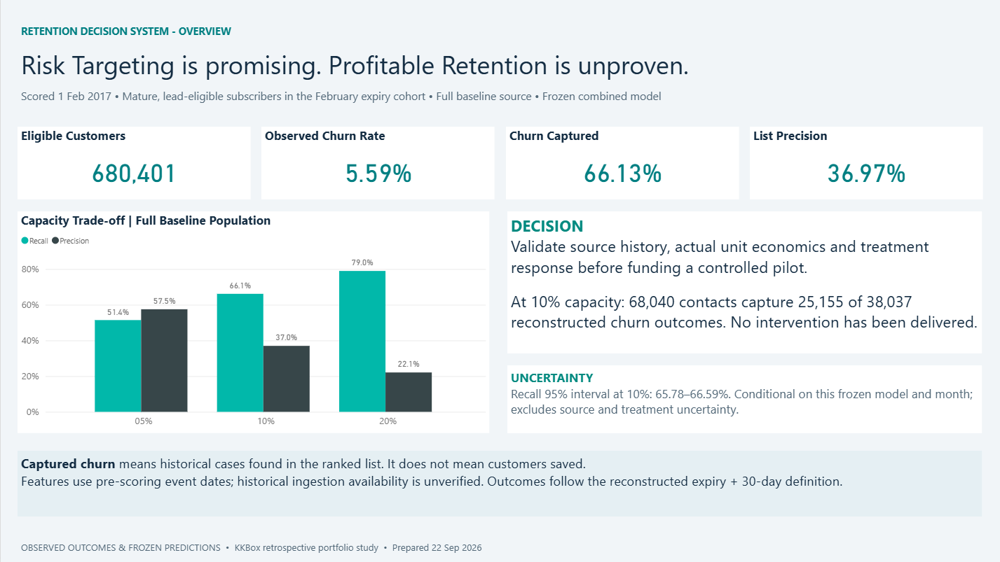
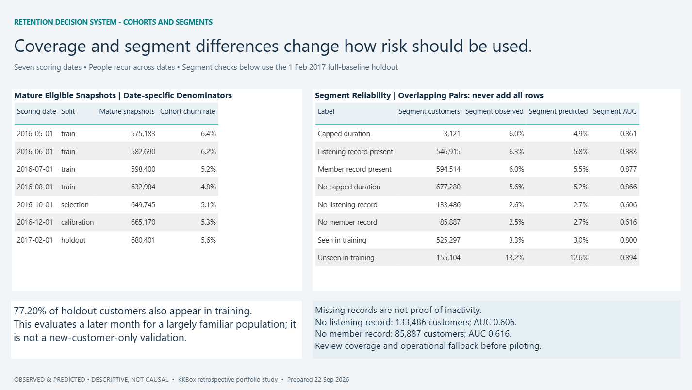
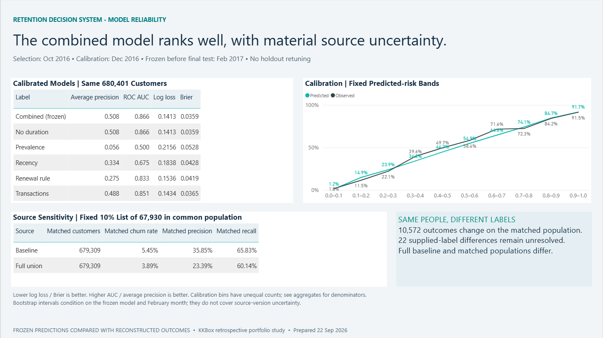
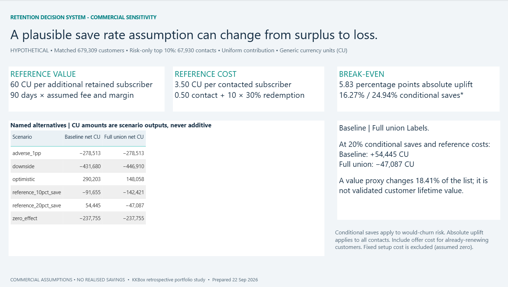
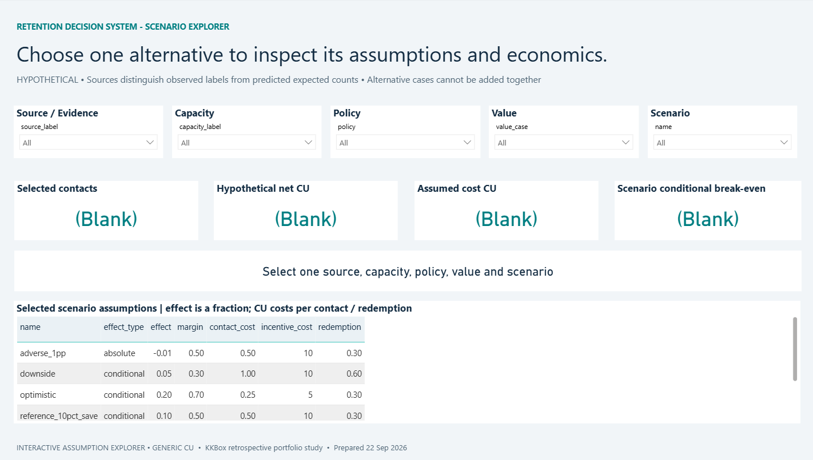
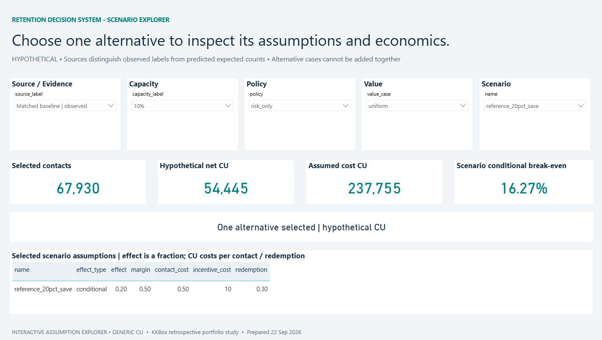
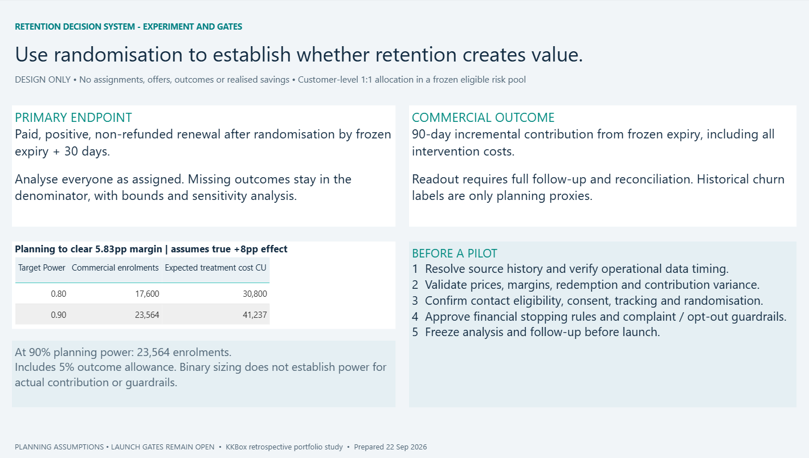

# Milestone 5 — executive report and decision memo

**22 September 2026: complete for the scoped retrospective report.**

The [six-page Power BI project](../dashboard/README.md) is built and was opened, refreshed and reviewed in Power BI Desktop. The [decision memo](decision_memo.md) explains the supported decision: validate source history, actual economics and treatment response before funding a controlled pilot.

## Delivered

- Portable PBIP/PBIR report, 14 public aggregate tables and 51 guarded or derived DAX measures.
- Overview, cohort/segment diagnosis, model reliability, commercial sensitivity, interactive scenario explorer and experiment-planning pages.
- Explicit observation dates, populations and uncertainty; observed, predicted and hypothetical values remain distinct.
- [Measure definitions and workflow](../docs/dashboard_workflow.md), [build manifest](../dashboard/build_manifest.json) and [independent verification](dashboard_verification.json).
- Actual Desktop screenshots, including ambiguous and valid scenario selections.

## Validation

All **28 analysis tests**, **2,196 dashboard reconciliation/binding checks** and **75 Microsoft JSON-schema checks** pass. Desktop refreshed the embedded aggregate tables without private inputs or credentials.

The overview matches 680,401 eligible customers, 5.59% churn, 66.13% recall and 36.97% precision. Selecting matched baseline / 10% / risk-only / uniform / 20% conditional saves displays 67,930 contacts, +54,445 CU net, 237,755 CU cost and 16.27% break-even. Ambiguous selections display blank monetary cards instead of adding alternatives.

## Review images

Screenshots refreshed on 23 September 2026 using the author's replacement captures.

## Scope and next step

This report does not establish operational readiness or realised savings. Source-version dependence, 22 unresolved supplied-label differences, unknown historical ingestion availability and unmeasured treatment effects remain explicit. No cloud report or campaign was published.

[Milestone 6](https://github.com/Jeks042/subscription-churn-retention/issues/6) is next: final reproducibility, consistency and portfolio review.
