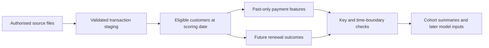

# Churn project progress — 22 September 2026

## Current position

Milestone 1 is complete with a scoped GO for retrospective analysis. Milestone 2's transaction SQL foundation has completed a successful full-data run, including its assertions and source/code manifest. Model fitting has not started.

## What exists

Features describe what happened before scoring. Labels describe what happened afterwards. Keeping those tables separate makes accidental use of future information easier to detect.

- GitHub repository and six delivery issues, organised in the Data Analytics Portfolio workspace.
- Authorised KKBox sources acquired locally; source data stays outside GitHub.
- Completed label, transaction, member and both listening-log audits. The original log has 392,106,543 rows across 26 months, with unique customer/date keys.
- Reconstructed cohorts at seven dates, with 4,384,573 outreach-eligible customer/date rows.
- Versioned SQL for staging, cohort labels, payment features and assertions.
- Passing synthetic tests, including future-data leakage, duplicate inflation and churn boundaries.
- SQL/Python label agreement on 7,000 sampled real customer/date records.

## Findings that matter

The first original log extraction was incomplete. A fresh extraction matches the full archive size and passed strict parsing and all monthly key checks. This replaces the earlier diagnosis of a malformed source row. Negative and unusually large listening durations are flagged for feature handling.

Backdated transactions in the refreshed release change historical outcomes. The SQL baseline freezes original history and adds March records for follow-up; a full-union sensitivity is recorded separately. Supplied Kaggle labels are not treated as interchangeable with the reconstructed historical outcome.

## Where to look

- [Validation findings](validation_findings.md)
- [SQL workflow and feature dictionary](../docs/sql_workflow.md)
- [Calendar and maturity](../docs/temporal_feasibility.md)
- [Synthetic label examples](../docs/label_examples.md)
- [Milestone 1 issue](https://github.com/Jeks042/subscription-churn-retention/issues/1)
- [Milestone 2 issue](https://github.com/Jeks042/subscription-churn-retention/issues/2)

Next: add listening features with anomaly/coverage flags, check the combined feature table and complete the SQL milestone. Source-version sensitivity and 22 unexplained supplied-label mismatches remain explicit limits on later model claims. No user action is currently required.
