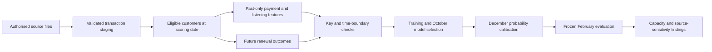

# Churn project progress — 22 September 2026

## Current position

Milestones 1–3 are complete for the scoped retrospective study. The frozen combined logistic regression has been evaluated on 680,401 February customers, with calibration, capacity scenarios, customer-bootstrap intervals, segment diagnostics and source sensitivity. Read the [milestone 3 findings and chart](milestone_3_findings.md). All 21 tests pass and an independent check matches all 96 reported model metric values.

At 10% contact capacity, the model captures 66.13% of reconstructed churn with 36.97% precision and 6.61× lift. The main limitation is source dependence: on the common eligible population, precision falls from 35.85% to 23.39% under alternative labels. These results support commercial scenario analysis, not a claim that an intervention saved customers.

## What exists

Features describe what happened before scoring. Labels describe what happened afterwards. Keeping those tables separate makes accidental use of future information easier to detect.

- GitHub repository and six delivery issues, organised in the Data Analytics Portfolio workspace.
- Authorised KKBox sources acquired locally; source data stays outside GitHub.
- Completed label, transaction, member and both listening-log audits. The original log has 392,106,543 rows across 26 months, with unique customer/date keys.
- Reconstructed cohorts at seven dates, with 4,384,573 outreach-eligible customer/date rows.
- Versioned SQL for staging, cohort labels, transaction/listening features, coverage and assertions.
- A combined 4,384,573-row feature table and explicit 38-predictor model input, with training-only fills.
- Twenty-one passing synthetic tests, including future-data leakage, duplicate inflation, churn boundaries, training-only preparation, weighted model metrics and capacity accounting.
- SQL/Python label agreement on 7,000 sampled real customer/date records.
- Independent listening agreement on 16,100 values across 700 sampled customer/date records.
- Five baseline families plus a duration ablation; a published model freeze before final evaluation.
- Customer-bootstrap uncertainty, calibration charts, overlap/segment/drift checks and fixed-score alternative-label sensitivity.
- Independent verification of 96 final-test metrics across six models with no differences.

## Findings that matter

The first original log extraction was incomplete. A fresh extraction matches the full archive size and passed strict parsing and all monthly key checks. This replaces the earlier diagnosis of a malformed source row. Negative durations are flagged and excluded from duration totals; large durations are bounded for features with explicit flags. Raw source values remain intact.

Backdated transactions in the refreshed release change historical outcomes. The SQL baseline freezes original history and adds March records for follow-up; a full-union sensitivity is recorded separately. Supplied Kaggle labels are not treated as interchangeable with the reconstructed historical outcome.

## Where to look

- [Validation findings](validation_findings.md)
- [Milestone 3 findings and chart](milestone_3_findings.md)
- [Model evaluation workflow](../docs/model_workflow.md)
- [Commercial handoff](../docs/commercial_handoff.md)
- [Milestone 2 findings and coverage](milestone_2_findings.md)
- [SQL workflow and feature dictionary](../docs/sql_workflow.md)
- [Model handoff](../docs/model_handoff.md)
- [Calendar and maturity](../docs/temporal_feasibility.md)
- [Synthetic label examples](../docs/label_examples.md)
- [Milestone 1 issue](https://github.com/Jeks042/subscription-churn-retention/issues/1)
- [Milestone 2 issue](https://github.com/Jeks042/subscription-churn-retention/issues/2)
- [Milestone 3 issue](https://github.com/Jeks042/subscription-churn-retention/issues/3)

Next: [milestone 4](https://github.com/Jeks042/subscription-churn-retention/issues/4) — contribution-value assumptions, contact/offer costs, break-even retention scenarios and a randomised intervention proposal. Source-version sensitivity, 22 unexplained supplied-label differences and unknown ingestion availability remain explicit limits. No user action is currently required.
