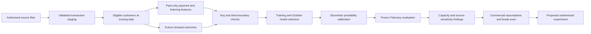

# Churn project progress — 22 September 2026

## Current position

Milestones 1–4 are complete for the scoped retrospective study. The commercial stage adds 360 named scenarios, 648 cost/value/response sensitivity rows and a customer-randomised experiment proposal. Read the [milestone 4 findings](milestone_4_findings.md). All 28 tests pass; 5,604 independent commercial calculations agree.

Under the assumed 60 CU retained contribution and 3.50 CU contact/offer cost, the matched 10% list needs to save 16.27% of would-be churners under baseline labels versus 24.94% under refreshed labels. A 20% save assumption produces a surplus in one source case and a loss in the other. The decision is further validation before a controlled pilot. No campaign or incremental retention has been measured.

## What exists

Features describe what happened before scoring. Labels describe what happened afterwards. Keeping those tables separate makes accidental use of future information easier to detect.

- GitHub repository and six delivery issues, organised in the Data Analytics Portfolio workspace.
- Authorised KKBox sources acquired locally; source data stays outside GitHub.
- Completed label, transaction, member and both listening-log audits. The original log has 392,106,543 rows across 26 months, with unique customer/date keys.
- Reconstructed cohorts at seven dates, with 4,384,573 outreach-eligible customer/date rows.
- Versioned SQL for staging, cohort labels, transaction/listening features, coverage and assertions.
- A combined 4,384,573-row feature table and explicit 38-predictor model input, with training-only fills.
- Twenty-eight passing synthetic tests, including future-data leakage, duplicate inflation, churn boundaries, training-only preparation, weighted model metrics and capacity accounting.
- SQL/Python label agreement on 7,000 sampled real customer/date records.
- Independent listening agreement on 16,100 values across 700 sampled customer/date records.
- Five baseline families plus a duration ablation; a published model freeze before final evaluation.
- Customer-bootstrap uncertainty, calibration charts, overlap/segment/drift checks and fixed-score alternative-label sensitivity.
- Independent verification of 96 final-test metrics across six models with no differences.
- Risk-only/value-proxy comparisons, conditional/absolute economics, 360 named scenarios and 648 sensitivity rows.
- Independent agreement on 5,604 commercial values; 24 conventional sample-size cases and commercial-margin planning.
- A proposed customer-randomised retention experiment with no real assignments or outreach.

## Findings that matter

The first original log extraction was incomplete. A fresh extraction matches the full archive size and passed strict parsing and all monthly key checks. This replaces the earlier diagnosis of a malformed source row. Negative durations are flagged and excluded from duration totals; large durations are bounded for features with explicit flags. Raw source values remain intact.

Backdated transactions in the refreshed release change historical outcomes. The SQL baseline freezes original history and adds March records for follow-up; a full-union sensitivity is recorded separately. Supplied Kaggle labels are not treated as interchangeable with the reconstructed historical outcome.

## Where to look

- [Milestone 4 findings and break-even chart](milestone_4_findings.md)
- [Commercial reproduction workflow](../docs/commercial_workflow.md)
- [Proposed retention experiment](../docs/retention_experiment.md)
- [Dashboard handoff](../docs/dashboard_handoff.md)
- [Validation findings](validation_findings.md)
- [Milestone 3 findings and chart](milestone_3_findings.md)
- [Model evaluation workflow](../docs/model_workflow.md)
- [Commercial handoff](../docs/commercial_handoff.md)
- [Milestone 2 findings and coverage](milestone_2_findings.md)
- [SQL workflow and feature dictionary](../docs/sql_workflow.md)
- [Model handoff](../docs/model_handoff.md)
- [Calendar and maturity](../docs/temporal_feasibility.md)
- [Synthetic label examples](../docs/label_examples.md)
- [Milestone 1 issue](https://github.com/Jeks042/subscription-churn-retention/issues/1)
- [Milestone 2 issue](https://github.com/Jeks042/subscription-churn-retention/issues/2)
- [Milestone 3 issue](https://github.com/Jeks042/subscription-churn-retention/issues/3)
- [Milestone 4 issue](https://github.com/Jeks042/subscription-churn-retention/issues/4)

Next: [milestone 5](https://github.com/Jeks042/subscription-churn-retention/issues/5) — Power BI executive reporting and a decision memo. All commercial amounts are generic CU scenarios. Source-version dependence, 22 unresolved supplied-label differences and unknown ingestion availability remain explicit limits. No user action is currently required.
