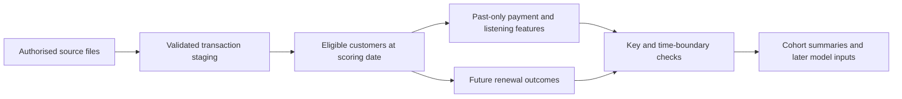

# Churn project progress — 22 September 2026

## Current position

Milestones 1 and 2 are complete. Milestone 3 is in progress: baseline fitting, October model selection and December calibration are complete. The combined logistic regression is frozen under the predeclared rule; final February evaluation has not yet started. The [evaluation plan](../docs/evaluation_plan.md), [model freeze](model_freeze.json) and [reproduction workflow](../docs/model_workflow.md) record the procedure before final evaluation. All 21 tests pass.

## What exists

Features describe what happened before scoring. Labels describe what happened afterwards. Keeping those tables separate makes accidental use of future information easier to detect.

- GitHub repository and six delivery issues, organised in the Data Analytics Portfolio workspace.
- Authorised KKBox sources acquired locally; source data stays outside GitHub.
- Completed label, transaction, member and both listening-log audits. The original log has 392,106,543 rows across 26 months, with unique customer/date keys.
- Reconstructed cohorts at seven dates, with 4,384,573 outreach-eligible customer/date rows.
- Versioned SQL for staging, cohort labels, transaction/listening features, coverage and assertions.
- A combined 4,384,573-row feature table and explicit 38-predictor model input, with training-only fills.
- Fifteen passing synthetic tests, including future-data leakage, duplicate inflation, churn boundaries and training-only preparation.
- SQL/Python label agreement on 7,000 sampled real customer/date records.
- Independent listening agreement on 16,100 values across 700 sampled customer/date records.

## Findings that matter

The first original log extraction was incomplete. A fresh extraction matches the full archive size and passed strict parsing and all monthly key checks. This replaces the earlier diagnosis of a malformed source row. Negative durations are flagged and excluded from duration totals; large durations are bounded for features with explicit flags. Raw source values remain intact.

Backdated transactions in the refreshed release change historical outcomes. The SQL baseline freezes original history and adds March records for follow-up; a full-union sensitivity is recorded separately. Supplied Kaggle labels are not treated as interchangeable with the reconstructed historical outcome.

## Where to look

- [Validation findings](validation_findings.md)
- [Milestone 2 findings and coverage](milestone_2_findings.md)
- [SQL workflow and feature dictionary](../docs/sql_workflow.md)
- [Model handoff](../docs/model_handoff.md)
- [Calendar and maturity](../docs/temporal_feasibility.md)
- [Synthetic label examples](../docs/label_examples.md)
- [Milestone 1 issue](https://github.com/Jeks042/subscription-churn-retention/issues/1)
- [Milestone 2 issue](https://github.com/Jeks042/subscription-churn-retention/issues/2)

Next: run the frozen February evaluation, customer-bootstrap intervals, segment checks and fixed-score source-label sensitivity. Source-version sensitivity and 22 unexplained supplied-label mismatches remain explicit limits on model claims. No user action is currently required.
